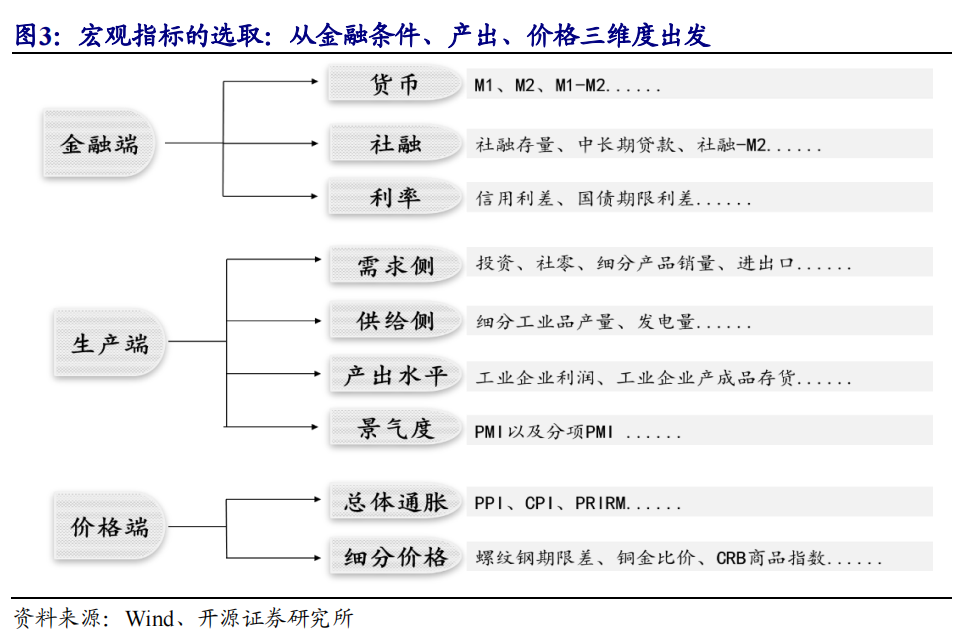

# 第一周汇报
> 在第一周中本小组主要学习金融相关知识和机器学习方面的工作

## 一、问题背景

​	在不断变化的全球经济环境中，传统的股票市场策略面临挑战。由于宏观经济指标与股市表现之间存在复杂的非线性关系，传统方法难以有效预测和适应这些变化。这导致在不同宏观经济情景下，如何选择和分配投资策略成为一个关键问题。

## 二、研究目标

​	开发一种基于机器学习的量化策略，能够在不同的宏观经济环境下准确预测股市策略的表现。这包括使用算法来分析宏观经济指标与股市策略之间的关系，建立一个能够适应经济变化的动态资产分配模型，提高投资组合的夏普比率，优化风险调整后的回报。

## 三、宏观指标体系

1. **什么是宏观指标体系**

   ​	宏观指标体系是一套用于评估和分析一个国家或地区经济状况的经济指标。这些指标包括但不限于国内生产总值(GDP)、通货膨胀率、失业率、利率和货币政策、国家财政政策、贸易平衡、以及生产力和经济增长等。通过这些指标，政府、企业、投资者和经济学家可以监测和预测经济表现，制定政策或投资决策。宏观经济指标反映了一个国家的经济健康水平，是理解全球经济动态的关键工具。

2. **宏观指标的选取及预处理**

预处理方式：*宏观数据已经按照[2]处理好了，具体可以问助教要百度云盘地址。*

>(1) 指标频率对齐。
>
>(2) 指标缺失值填充。
>
>(3) 季调。
>
>(4) 极端值剔除。
>
>(5) 平滑。

3. **宏观指标处理方法**

   ​	文件《宏观指标处理方法》概述了处理宏观经济数据的关键步骤和方法。报告首先介绍了频率对齐、指标缺失值填充和极端值剔除等基本的数据处理技巧。接着，报告详细分类并解释了不同的宏观经济指标，如货币、信用和市场指标（例如M1, M2, 社融规模增量），以及经济周期指标（如PMI、CPI、PPI等）。每个指标都有相应的处理方法，例如同比、环比等，这些方法对于分析宏观经济状况至关重要。

​	**货币、信用、市场**

| 指标                       | 频率   | 处理方法   |
| -------------------------- | ------ | :--------- |
| M1                         | 月     | 同比       |
| M2                         | 月     | 同比       |
| M1-M2                      | 月     | 同比或环比 |
| 社融规模增量               | 月     | 同比       |
| 公开市场操作（货币净投放） | 日周月 |            |
| 10年期国债收益率（CHN）    | 月     |            |
| 10年期国债收益率（US）     | 日     |            |
| 美元指数                   | 日     |            |
| VIX恐慌指数                | 日     |            |
|                            |        |            |

> 1. **M1货币：**
>
>    - **定义：** M1货币是一种狭义的货币供应度量，包括了最流动、最易于用于交易的货币。
>    - **组成：** M1货币包括流通中的货币和即期存款。
>    - 具体包括：
>      - 流通中的现金（纸币和硬币）。
>      - 即期存款（可随时提取的存款）。
>
> 2. **M2货币：**
>
>    - **定义：** M2货币是一种广义的货币供应度量，包含了相对较流动的货币和较不流动的储蓄形式的货币。
>    - **组成：** M2货币包括M1货币以及其他较长期的储蓄存款、定期存款和其他可转换的时间存款。
>    - 具体包括：
>      - M1货币。
>      - 储蓄存款。
>      - 定期存款。
>      - 其他可转换的时间存款。

**经济周期**

| 指标                      | 频率 | 处理方法   |
| ------------------------- | ---- | ---------- |
| PMI（制造业）             | 月   |            |
| PMI（非制造业）           | 月   |            |
| CPI                       | 月   | 当月同比   |
| PPI（工业生产者出厂价格） | 月   | 当月同比   |
| PPIRM（~进购价格）        | 月   | 当月同比   |
| 工业增加值                | 月   | 同比或环比 |
| 发电量产量                | 月   | 当期同比   |
| 规模以上工业增加值        | 月   | 同比或环比 |
| 工业企业产成品存货        | 月   | 同比       |
| 亏损企业数比例            | 月   |            |
| 商品销售额（US）          | 月   | 同比       |
| 出口金额（韩）            | 月   | 同比       |

> 同比与环比：
>
> 1. **同比 (Year-over-Year, YoY)**：这是一种比较同一时间点在不同年份的数据。例如，2023年3月的某个经济指标与2022年3月该指标的对比，可以反映出一年的变化趋势。
> 2. **环比 (Month-over-Month, MoM)**：环比则是比较连续两个时间段（通常是月份）的数据。例如，将2023年3月的经济数据与2023年2月的数据进行比较，以观察短期内的变化趋势。

**宏观指标的具体解释：**

1. **中美十年期国债利差：** 衡量中美两国十年期国债利率之间的差异。这一差异通常用来评估两国利率政策和市场对不同国家经济状况的预期。
2. **信用利差：** 表示不同信用质量债券利率之间的差异。较高的信用利差可能反映市场对信用风险的担忧。
3. **CRB现货指数:工业原料/金属：** CRB指数是衡量全球商品价格的指标。工业原料和金属子指数分别反映了这两个类别商品价格的变动。
4. **COMEX:金铜比：** 表示黄金和铜的价格比率。这一比率有时被视为经济指标，因为金和铜在不同经济环境下具有不同的用途。
5. **期货结算价(连续):WTI原油：** WTI原油期货合约的结算价格，WTI原油价格通常被视为全球油价的重要指标。
6. **波罗的海干散货指数BDI：** 衡量全球干散货运输市场的指数，反映了国际贸易和经济活动的强度。
7. **PPIRM（生产者价格指数-原材料）不同类别的当期同比：** 表示中国工业生产者出厂价格指数中各类别原材料价格的同比变动情况。不同类别包括其他工业原材料、纺织原料、建筑材料、农副产品、燃料及动力、化工原料、有色金属材料、木材及纸浆、黑色金属材料等。
8. **PPI(上月=100):当期值:月：** 生产者价格指数，以上月为基准（基础值为100），衡量了当期生产者支付的商品和服务的平均价格变动。
9. **PPI(上年同月=100):当期值:月：** 生产者价格指数，以去年同月为基准（基础值为100），衡量了当期生产者支付的商品和服务的平均价格变动。
10. **原料类工业品出厂价格指数PPI:(上年=100):当期值:月：** 衡量原材料类工业品的出厂价格变动，以去年为基准（基础值为100）。
11. **衣着类工业品出厂价格指数PPI:(上年=100):当期值:月：** 衡量衣着类工业品的出厂价格变动，以去年为基准（基础值为100）。
12. **采掘类工业品出厂价格指数PPI:(上年=100):当期值:月：** 衡量采掘类工业品的出厂价格变动，以去年为基准（基础值为100）。
13. **加工类工业品出厂价格指数PPI:(上年=100):当期值：** 衡量加工类工业品的出厂价格变动，以去年为基准（基础值为100）。
14. **食品类工业品出厂价格指数PPI:(上年=100):当期值:月：** 衡量食品类工业品的出厂价格变动，以去年为基准（基础值为100）。
15. **非制造业PMI:存货:当期值:月：** 非制造业采购经理指数中关于存货水平的当期数值。
16. **非制造业PMI:新订单:当期值:月：** 非制造业采购经理指数中关于新订单的当期数值。
17. **制造业PMI:进口:当期值:月：** 制造业采购经理指数中关于进口水平的当期数值。
18. **制造业PMI:生产:当期值:月：** 制造业采购经理指数中关于生产水平的当期数值。
19. **制造业PMI:当期值:月：** 制造业采购经理指数的总体当期数值。
20. **CPI:环比:月：** 消费者价格指数，表示当月与上月相比的价格变动情况。
21. **CPI:非食品:当期同比:月：** 消费者价格指数中非食品部分的当期同比变动情况。
22. **CPI:食品:当期同比:月：** 消费者价格指数中食品部分的当期同比变动情况。
23. **CPI:当期同比:月：** 消费者价格指数总体的当期同比变动情况。
24. **亏损企业亏损总额:亏损企业亏损额GB2011:总计:当期同比:月：** 表示亏损企业在当期的总亏损额，同比表示与去年同期相比的变动情况。
25. **负债合计:工业企业(GB2011):总计:同比:月：** 衡量工业企业的总负债水平，同比表示与去年同期相比的变动情况。
26. **财务费用GB2011:总计:累计同比:月：** 工业企业的累计财务费用，同比表示与去年同期相比的变动情况。
27. **产成品GB2011:总计:同比:月：** 工业企业产成品的总产值，同比表示与去年同期相比的变动情况。
28. **准货币(M2-M1):同比:月：** 表示M2货币减去M1货币的差异，同比表示相较于去年同期的变动情况。M1包括货币供应中的流通货币和其他即期存款，而M2则包括M1以及较长期的储蓄存款、定期存款和其他可转换的时间存款。
29. **M2初值:当期同比:月：** M2货币供应的初步数值，同比表示相较于去年同期的变动情况。M2是广义货币供应的一种度量，包括M1以及其他储蓄和时间存款。
30. **M1初值:当期同比:月：** M1货币供应的初步数值，同比表示相较于去年同期的变动情况。M1主要包括流通中的货币和即期存款。
31. **社会融资规模存量:同比:月：** 衡量一定时期内社会融资规模的累计余额，同比表示相较于去年同期的变动情况。社会融资规模通常包括信贷、股票、债券等多种金融工具。
32. **出口额(以美元计):累计同比:月：** 表示一定时期内的出口额的累计余额，以美元计价，同比表示相较于去年同期的变动情况。
33. **进口额(以美元计):累计同比:月：** 表示一定时期内的进口额的累计余额，以美元计价，同比表示相较于去年同期的变动情况。
34. **发电量产量:当期同比:月：** 表示当期发电量的产量，同比表示相较于去年同期的变动情况。

## 四、策略指数体系

1. **什么是策略指数**

   ​	策略指数是一种股票市场指数，它根据特定的投资策略或规则来选择和权重其成分股。这种类型的指数通常采用系统化的、基于规则的方法来构建，目的是捕捉某些市场因素或特定投资风格的表现。例如，策略指数可能侧重于低波动性股票、高股息率股票、或具有特定基本面属性的股票。它们为投资者提供了一种不同于传统市值加权指数的方式来接触和利用市场动态。通过这种方式，策略指数可以帮助投资者实现更加定制化和专门化的投资目标。

   ​	在 MSCI 的指数分类，策略指数（STRATEGY INDEXES）主要包括两类：因子指数（factor）和其他策略指数（ex. factor）。

2. 理解策略指数

   **MSCI策略指数**

   - MSCI的策略指数主要包括因子指数和其他策略指数。 
   - 因子指数是建立在系统性规则基础上的指数，代表了一系列在长期中能够获得风险溢价的因子的收益，如低波动率、价值、小市值、高股息、质量和动量。 
   - MSCI还开发了多因子策略指数，旨在向机构投资提供透明高效的投资工具，包括混合因子指数和优化因子指数两类。 

   **中证策略指数**

   - 中证指数公司提供了较多的策略类指数，其中包括基本面指数、高/低贝塔指数等。  

   - 基本面指数按照基本面价值进行打分筛选成分股，而高/低贝塔指数成分股权重由历史贝塔确定。

## 五、Transformer模型

1. Transformer整体结构

   首先介绍 Transformer 的整体结构

   

   可以看到 **Transformer 由 Encoder 和 Decoder 两个部分组成**，Encoder 和 Decoder 都包含 6 个 block。Transformer 的工作流程大体如下：

   **第一步：**获取输入句子的每一个单词的表示向量 **X**，**X**由单词的 Embedding（Embedding就是从原始数据提取出来的Feature） 和单词位置的 Embedding 相加得到。

   **第二步：**将得到的单词表示向量矩阵 (如上图所示，每一行是一个单词的表示 **x**) 传入 Encoder 中，经过 6 个 Encoder block 后可以得到句子所有单词的编码信息矩阵 **C**，如下图。单词向量矩阵用 ��×� 表示， n 是句子中单词个数，d 是表示向量的维度 (论文中 d=512)。每一个 Encoder block 输出的矩阵维度与输入完全一致。

   **第三步**：将 Encoder 输出的编码信息矩阵 **C**传递到 Decoder 中，Decoder 依次会根据当前翻译过的单词 1~ i 翻译下一个单词 i+1，如下图所示。在使用的过程中，翻译到单词 i+1 的时候需要通过 **Mask (掩盖)** 操作遮盖住 i+1 之后的单词。

2. Tranformer的输入

   Transformer 中单词的输入表示 **x**由**单词 Embedding** 和**位置 Embedding** （Positional Encoding）相加得到。

   单词的 Embedding 有很多种方式可以获取，例如可以采用 Word2Vec、Glove 等算法预训练得到，也可以在 Transformer 中训练得到。

   Transformer 中除了单词的 Embedding，还需要使用位置 Embedding 表示单词出现在句子中的位置。**因为 Transformer 不采用 RNN 的结构，而是使用全局信息，不能利用单词的顺序信息，而这部分信息对于 NLP 来说非常重要。**所以 Transformer 中使用位置 Embedding 保存单词在序列中的相对或绝对位置。

   位置 Embedding 用 **PE**表示，**PE** 的维度与单词 Embedding 是一样的。PE 可以通过训练得到，也可以使用某种公式计算得到。

3. Self-Attention

   

   对于上图中的结构，在计算的时候需要用到矩阵**Q(查询),K(键值),V(值)**。在实际中，Self-Attention 接收的是输入(单词的表示向量x组成的矩阵X) 或者上一个 Encoder block 的输出。而**Q,K,V**正是通过 Self-Attention 的输入进行线性变换得到的。

   若我们使用矩阵X表示结构的输入，我们可以使用线性变阵矩阵**WQ,WK,WV**计算得到**Q,K,V**

   得到矩阵 Q, K, V之后就可以计算出 Self-Attention 的输出了

   

   公式中计算矩阵**Q**和**K**每一行向量的内积，为了防止内积过大，因此除以dk的平方根。**Q**乘以**K**的转置后，得到的矩阵行列数都为 n，n 为句子单词数，这个矩阵可以表示单词之间的 attention 强度。

   Multi-Head Attention 是由多个 Self-Attention 组合形成的，将输入**X**分别传递到 h 个不同的 Self-Attention 中，计算得到 h 个输出矩阵**Z**

4. Encoder

   Add & Norm 层由 Add 和 Norm 两部分组成，前者是一种残差连接，通常用于解决多层网络训练的问题，可以让网络只关注当前差异的部分，后者是Layer Normalization，通常用于 RNN 结构，Layer Normalization 会将每一层神经元的输入都转成均值方差都一样的，这样可以加快收敛。

   Feed Forward 是一个两层的全连接层，第一层的激活函数为 Relu，第二层不使用激活函数。

   第一个 Encoder block 的输入为句子单词的表示向量矩阵，后续 Encoder block 的输入是前一个 Encoder block 的输出，最后一个 Encoder block 输出的矩阵就是**编码信息矩阵 C**，这一矩阵后续会用到 Decoder 中。

5. Decoder

   Decoder block 的第一个 Multi-Head Attention 采用了 Masked 操作，因为在翻译的过程中是顺序翻译的，即翻译完第 i 个单词，才可以翻译第 i+1 个单词。通过 Masked 操作可以防止第 i 个单词知道 i+1 个单词之后的信息。

   Decoder block 第二个 Multi-Head Attention 变化不大， 主要的区别在于其中 Self-Attention 的 **K, V**矩阵不是使用 上一个 Decoder block 的输出计算的，而是使用 **Encoder 的编码信息矩阵 C** 计算的。这样做的好处是在 Decoder 的时候，每一位单词都可以利用到 Encoder 所有单词的信息 (这些信息无需 **Mask**)。

   Decoder block 最后的部分是利用 Softmax 预测下一个单词，在之前的网络层我们可以得到一个最终的输出 Z，因为 Mask 的存在，使得单词 0 的输出 Z0 只包含单词 0 的信息。Softmax 根据输出矩阵的每一行预测下一个单词。

## 六、数学和机器学习知识

### KL散度

KL散度，也称为相对熵（Relative Entropy），是用来衡量两个概率分布之间的差异的一种度量方式。它衡量的是当用一个分布Q来拟合真实分布P时所需要的额外信息的平均量。

KL散度的定义是建立在信息论中的熵(Entropy)的基础上的。此处以离散随机变量为例，先给出 熵的定义，再给定KL散度定义。

一个离散随机变量 $X$ 的可能取值为 $X=x_1, x_2, \ldots, x_n$ ， 而对应的概率为 $p_i=p\left(X=x_i\right)$ ，则随机变量的摘定义为:
$$
H(X)=-\sum_{i=1}^n p\left(x_i\right) \log p\left(x_i\right)
$$

规定当 $p\left(x_i\right)=0$ 时， $p\left(x_i\right) \log \left(p\left(x_i\right)=0\right.$

如果是两个随机变量 $P, Q$ ，且其概率分布分别为 $p(x), q(x)$ ，则 $p$ 相对 $q$ 的相对熵为:
$$
D_{K L}(p \| q)=\sum_{i=1}^n p(x) \log \frac{p(x)}{q(x)}
$$

针对上述离散变量的概率分布 $p(x) 、 q(x)$ 而言，其 交叉熵 定义为:
$$
H(p, q)=\sum_x p(x) \log \frac{1}{q(x)}=-\sum_x p(x) \log q(x)
$$
因此，KL散度或相对熵可通过下式得出：
$$
\begin{aligned}
D_{K L}(p \| q) & =H(p, q)-H(p) \\
& =-\sum_x p(x) \log q(x)-\sum_x-p(x) \log p(x) \\
& =-\sum_x p(x)(\log q(x)-\log p(x)) \\
& =-\sum_x p(x) \log \frac{q(x)}{p(x)}
\end{aligned}
$$
其实KL散度也是我们常见机器学习中使用交叉熵作为损失函数的关键。交叉熵通常用于监督学习任务中，如分类和回归等。在这些任务中，我们有一组输入样本和相应的标签。我们希望训练一个模型，使得模型能够将输入样本映射到正确的标签上。

计算$\sum_{a=0 / 1, b=0 / 1} \mathrm{KL}$ (policy|a, b, policy). 注: policy| $ a$ 是指 condition on $a$ 的情况下的策略 policy 的月收益的分布 ：这里的解释就是判断使用a这个宏观指标对于policy分布的影响，也就是作为筛选因子的条件和依据

### self-supervised learning

自监督学习（self-supervised learning）是一种机器学习的范畴，其中模型从未标记的数据中自行学习表示。与监督学习不同，自监督学习的训练数据并不需要人工标记的标签。相反，系统通过设计任务来自动生成标签，然后使用这些生成的标签进行学习。

自监督学习的核心思想是从数据中学到有意义的表示，而不是通过外部注释提供的标签。这通常涉及将输入数据中的一部分作为输入，而将另一部分作为目标，然后训练模型以学习将输入映射到目标的表示。这个目标可以通过对数据进行某种形式的变换或者生成相邻的上下文来创建。

总结Transformer模型中常见的自监督学习步骤包括：

1. **Masked Language Model (MLM)：**
   - 从输入序列中随机选择一些token，并将它们替换为特殊的"MASK" token。
   - 模型的任务是预测这些被遮蔽的token。在训练时，模型能够看到整个序列，但在预测时需要对遮蔽的token进行预测。
2. **Transformer Encoder：**
   - 使用Transformer的编码器（Encoder）来对输入序列进行编码。编码器会为每个token生成一个上下文感知的表示。
3. **Objective Function：**
   - 定义一个目标函数，通常采用softmax激活函数和交叉熵损失，用于衡量模型预测被遮蔽token的准确性。
4. **Positional Encoding：**
   - 因为Transformer没有显式处理序列的顺序信息，通常需要添加位置编码（Positional Encoding）以保留输入序列中元素的位置信息。
5. **Bi-directional Context：**
   - 与传统的从左到右或从右到左的语言模型不同，Transformer允许双向（bidirectional）上下文建模，因为它同时考虑了输入序列中每个位置的上下文。
6. **Training Process：**
   - 在训练时，模型通过最小化预测误差来学习上下文感知的表示。这个过程在整个训练数据集上进行，模型通过自监督任务学习通用的特征表示。
7. **Fine-tuning：**
   - 在预训练阶段完成后，可以将预训练的Transformer模型用于特定任务的微调。这可以是文本分类、命名实体识别等任务。

对于步骤5的第一步 `需要先利用self-supervised learning来一个宏观数据的embedding`可以理解为embedding也是模型的一部分，在训练模型的时候，相当于也是在训练embedding，在Transformer中用自监督的方式即可对模型进行训练

步骤5的第二步可以通过Transformer模型的训练完成，由于下游任务的改变（二分类问题），因此类似于当前步骤需要的是进行模型微调，需要利用pytorch进行微调。
