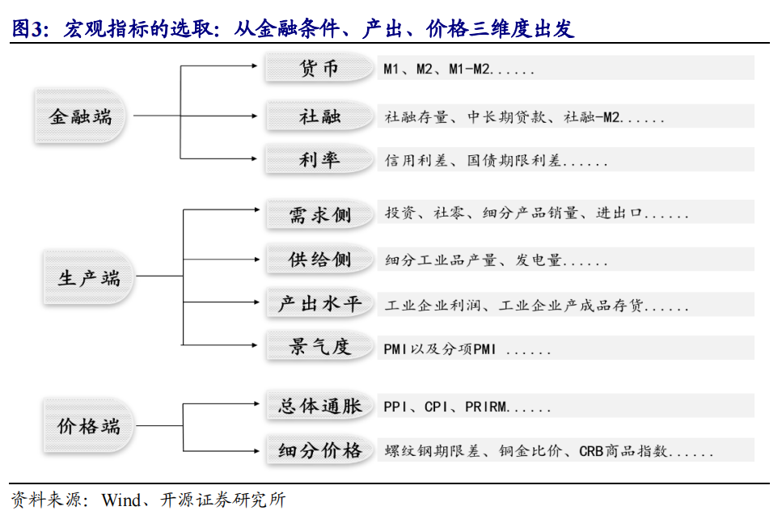

## 一、问题背景

​	在不断变化的全球经济环境中，传统的股票市场策略面临挑战。由于宏观经济指标与股市表现之间存在复杂的非线性关系，传统方法难以有效预测和适应这些变化。这导致在不同宏观经济情景下，如何选择和分配投资策略成为一个关键问题。

## 二、研究目标

​	开发一种基于机器学习的量化策略，能够在不同的宏观经济环境下准确预测股市策略的表现。这包括使用算法来分析宏观经济指标与股市策略之间的关系，建立一个能够适应经济变化的动态资产分配模型，提高投资组合的夏普比率，优化风险调整后的回报。

## 三、宏观指标体系

1. **什么是宏观指标体系**

   ​	宏观指标体系是一套用于评估和分析一个国家或地区经济状况的经济指标。这些指标包括但不限于国内生产总值(GDP)、通货膨胀率、失业率、利率和货币政策、国家财政政策、贸易平衡、以及生产力和经济增长等。通过这些指标，政府、企业、投资者和经济学家可以监测和预测经济表现，制定政策或投资决策。宏观经济指标反映了一个国家的经济健康水平，是理解全球经济动态的关键工具。

2. **宏观指标的选取及预处理**

预处理方式：*宏观数据已经按照[2]处理好了，具体可以问助教要百度云盘地址。*

>(1) 指标频率对齐。
>
>(2) 指标缺失值填充。
>
>(3) 季调。
>
>(4) 极端值剔除。
>
>(5) 平滑。

3. **宏观指标处理方法**

   ​	文件《宏观指标处理方法》概述了处理宏观经济数据的关键步骤和方法。报告首先介绍了频率对齐、指标缺失值填充和极端值剔除等基本的数据处理技巧。接着，报告详细分类并解释了不同的宏观经济指标，如货币、信用和市场指标（例如M1, M2, 社融规模增量），以及经济周期指标（如PMI、CPI、PPI等）。每个指标都有相应的处理方法，例如同比、环比等，这些方法对于分析宏观经济状况至关重要。

​	**货币、信用、市场**

| 指标                       | 频率   | 处理方法   |
| -------------------------- | ------ | :--------- |
| M1                         | 月     | 同比       |
| M2                         | 月     | 同比       |
| M1-M2                      | 月     | 同比或环比 |
| 社融规模增量               | 月     | 同比       |
| 公开市场操作（货币净投放） | 日周月 |            |
| 10年期国债收益率（CHN）    | 月     |            |
| 10年期国债收益率（US）     | 日     |            |
| 美元指数                   | 日     |            |
| VIX恐慌指数                | 日     |            |
|                            |        |            |

 	**经济周期**

| 指标                      | 频率 | 处理方法   |
| ------------------------- | ---- | ---------- |
| PMI（制造业）             | 月   |            |
| PMI（非制造业）           | 月   |            |
| CPI                       | 月   | 当月同比   |
| PPI（工业生产者出厂价格） | 月   | 当月同比   |
| PPIRM（~进购价格）        | 月   | 当月同比   |
| 工业增加值                | 月   | 同比或环比 |
| 发电量产量                | 月   | 当期同比   |
| 规模以上工业增加值        | 月   | 同比或环比 |
| 工业企业产成品存货        | 月   | 同比       |
| 亏损企业数比例            | 月   |            |
| 商品销售额（US）          | 月   | 同比       |
| 出口金额（韩）            | 月   | 同比       |

> 同比与环比：
>
> 1. **同比 (Year-over-Year, YoY)**：这是一种比较同一时间点在不同年份的数据。例如，2023年3月的某个经济指标与2022年3月该指标的对比，可以反映出一年的变化趋势。
> 2. **环比 (Month-over-Month, MoM)**：环比则是比较连续两个时间段（通常是月份）的数据。例如，将2023年3月的经济数据与2023年2月的数据进行比较，以观察短期内的变化趋势。

## 四、策略指数体系

1. **什么是策略指数**

   ​	策略指数是一种股票市场指数，它根据特定的投资策略或规则来选择和权重其成分股。这种类型的指数通常采用系统化的、基于规则的方法来构建，目的是捕捉某些市场因素或特定投资风格的表现。例如，策略指数可能侧重于低波动性股票、高股息率股票、或具有特定基本面属性的股票。它们为投资者提供了一种不同于传统市值加权指数的方式来接触和利用市场动态。通过这种方式，策略指数可以帮助投资者实现更加定制化和专门化的投资目标。

   ​	在 MSCI 的指数分类，策略指数（STRATEGY INDEXES）主要包括两类：因子指数（factor）和其他策略指数（ex. factor）。

2. 理解策略指数

   **MSCI策略指数**

   - MSCI的策略指数主要包括因子指数和其他策略指数。 
   - 因子指数是建立在系统性规则基础上的指数，代表了一系列在长期中能够获得风险溢价的因子的收益，如低波动率、价值、小市值、高股息、质量和动量。 
   - MSCI还开发了多因子策略指数，旨在向机构投资提供透明高效的投资工具，包括混合因子指数和优化因子指数两类。 

   **中证策略指数**

   - 中证指数公司提供了较多的策略类指数，其中包括基本面指数、高/低贝塔指数等。  

   - 基本面指数按照基本面价值进行打分筛选成分股，而高/低贝塔指数成分股权重由历史贝塔确定。

## 五、Transformer模型

1. Transformer整体结构

   首先介绍 Transformer 的整体结构

   

   可以看到 **Transformer 由 Encoder 和 Decoder 两个部分组成**，Encoder 和 Decoder 都包含 6 个 block。Transformer 的工作流程大体如下：

   **第一步：**获取输入句子的每一个单词的表示向量 **X**，**X**由单词的 Embedding（Embedding就是从原始数据提取出来的Feature） 和单词位置的 Embedding 相加得到。

   **第二步：**将得到的单词表示向量矩阵 (如上图所示，每一行是一个单词的表示 **x**) 传入 Encoder 中，经过 6 个 Encoder block 后可以得到句子所有单词的编码信息矩阵 **C**，如下图。单词向量矩阵用 ��×� 表示， n 是句子中单词个数，d 是表示向量的维度 (论文中 d=512)。每一个 Encoder block 输出的矩阵维度与输入完全一致。

   **第三步**：将 Encoder 输出的编码信息矩阵 **C**传递到 Decoder 中，Decoder 依次会根据当前翻译过的单词 1~ i 翻译下一个单词 i+1，如下图所示。在使用的过程中，翻译到单词 i+1 的时候需要通过 **Mask (掩盖)** 操作遮盖住 i+1 之后的单词。

2. Tranformer的输入

   Transformer 中单词的输入表示 **x**由**单词 Embedding** 和**位置 Embedding** （Positional Encoding）相加得到。

   单词的 Embedding 有很多种方式可以获取，例如可以采用 Word2Vec、Glove 等算法预训练得到，也可以在 Transformer 中训练得到。

   Transformer 中除了单词的 Embedding，还需要使用位置 Embedding 表示单词出现在句子中的位置。**因为 Transformer 不采用 RNN 的结构，而是使用全局信息，不能利用单词的顺序信息，而这部分信息对于 NLP 来说非常重要。**所以 Transformer 中使用位置 Embedding 保存单词在序列中的相对或绝对位置。

   位置 Embedding 用 **PE**表示，**PE** 的维度与单词 Embedding 是一样的。PE 可以通过训练得到，也可以使用某种公式计算得到。

3. Self-Attention

   

   对于上图中的结构，在计算的时候需要用到矩阵**Q(查询),K(键值),V(值)**。在实际中，Self-Attention 接收的是输入(单词的表示向量x组成的矩阵X) 或者上一个 Encoder block 的输出。而**Q,K,V**正是通过 Self-Attention 的输入进行线性变换得到的。

   若我们使用矩阵X表示结构的输入，我们可以使用线性变阵矩阵**WQ,WK,WV**计算得到**Q,K,V**

   得到矩阵 Q, K, V之后就可以计算出 Self-Attention 的输出了

   

   公式中计算矩阵**Q**和**K**每一行向量的内积，为了防止内积过大，因此除以dk的平方根。**Q**乘以**K**的转置后，得到的矩阵行列数都为 n，n 为句子单词数，这个矩阵可以表示单词之间的 attention 强度。

4. Encoder

5. Decoder
